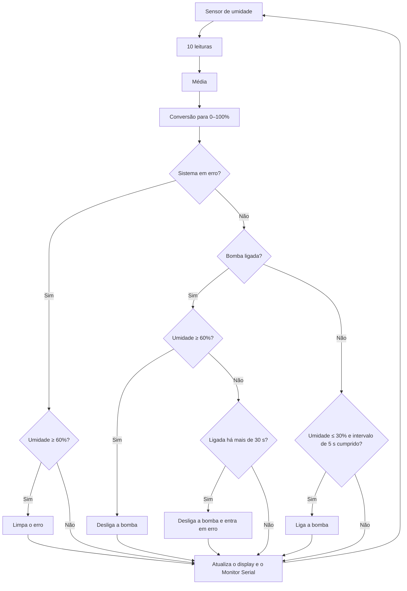

# Sistema de Irrigação Automática

Sistema de irrigação automática baseado em Arduino Uno. O sistema monitora a umidade do solo por meio de um sensor analógico e aciona uma bomba d'água quando o solo atinge um nível de umidade baixo. Um display OLED exibe a umidade em porcentagem, o estado da bomba e um indicador visual das condições do solo.

## Demonstração

## Funcionalidades

- Leitura da umidade do solo com média de 10 amostras para reduzir ruído
- Controle da bomba com histerese: aciona com 30% ou menos e desliga com 60% ou mais, evitando acionamentos repetidos
- Proteção por tempo máximo de operação: se a bomba permanecer ligada por mais de 30 segundos sem que o solo atinja a umidade desejada, ela é desligada e o sistema entra em estado de erro
- Intervalo mínimo entre acionamentos da bomba
- Display OLED com porcentagem de umidade, barra de nível, estado da bomba e indicador visual
- Monitoramento em tempo real pelo Monitor Serial

## Componentes

| Componente | Quantidade |
|---|---|
| Arduino Uno | 1 |
| Sensor de umidade do solo (saída analógica) | 1 |
| Display OLED SSD1306 128x64 (I2C) | 1 |
| Módulo relé 5V | 1 |
| Bomba d'água ou válvula solenoide | 1 |
| Fonte de alimentação para a bomba, mangueira e jumpers | — |

## Ligações

| Componente | Pino do componente | Pino no Arduino Uno |
|---|---|---|
| Sensor de umidade | VCC | 5V |
| | GND | GND |
| | AO (saída analógica) | A0 |
| Display OLED | VCC | 5V |
| | GND | GND |
| | SDA | A4 |
| | SCL | A5 |
| Módulo relé | VCC | 5V |
| | GND | GND |
| | IN | D4 |

A bomba deve ser alimentada por uma fonte externa através dos contatos do relé, e não diretamente pelos pinos do Arduino.

## Funcionamento



## Display

O display exibe na linha superior o estado da bomba (LIGADA, DESLIGADA ou ERRO), no centro a umidade em porcentagem e, na parte inferior, uma barra de nível. Ao lado da porcentagem, um indicador em forma de rosto representa a condição do solo:

| Condição | Indicador |
|---|---|
| Umidade de 60% ou mais | Feliz |
| Umidade entre 31% e 59% | Neutro |
| Umidade de 30% ou menos | Triste |
| Sistema em erro | Neutro |

## Instalação

1. Instale a [Arduino IDE](https://www.arduino.cc/en/software).
2. Em **Ferramentas > Gerenciar Bibliotecas**, instale a biblioteca `Adafruit SSD1306`. As dependências `Adafruit GFX Library` e `Adafruit BusIO` são instaladas automaticamente.
3. Abra o arquivo [`sistema_irrigacao/sistema_irrigacao.ino`](sistema_irrigacao/sistema_irrigacao.ino).
4. Selecione a placa **Arduino Uno** e a porta correspondente.
5. Faça o upload.

## Configuração

Os parâmetros do sistema ficam definidos no início do código:

| Constante | Valor padrão | Descrição |
|---|---|---|
| `valorSeco` | `1023` | Leitura do sensor com o solo completamente seco |
| `valorAgua` | `300` | Leitura do sensor imerso em água |
| `limiteLiga` | `30` | Umidade (%) em que a bomba é acionada |
| `limiteDesliga` | `60` | Umidade (%) em que a bomba é desligada |
| `tempoMaxBomba` | `30000` | Tempo máximo de operação contínua da bomba (ms) |
| `tempoEsperaBomba` | `5000` | Intervalo mínimo entre acionamentos (ms) |
| `RELE_LIGA` / `RELE_DESLIGA` | `HIGH` / `LOW` | Nível lógico de acionamento do relé |

### Calibração do sensor

1. Abra o Monitor Serial com taxa de 9600 baud.
2. Com o sensor seco, anote o valor exibido em `Sensor:` e atribua a `valorSeco`.
3. Com o sensor imerso em água até a linha limite, anote o valor e atribua a `valorAgua`.

### Relé ativo em nível baixo

Caso a bomba seja acionada assim que o Arduino é ligado, o módulo relé opera em nível lógico baixo. Nesse caso, inverta os valores:

```cpp
const int RELE_LIGA = LOW;
const int RELE_DESLIGA = HIGH;
```

### Tempo máximo de operação

Se o sistema entrar em erro mesmo com água disponível, a água pode estar levando mais tempo para alcançar o sensor. Nesse caso, aumente o valor de `tempoMaxBomba`.

## Autor

Lucas Carmo
